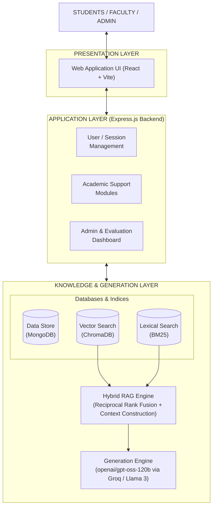
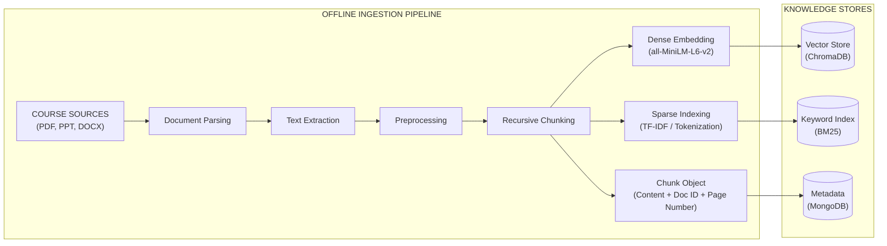
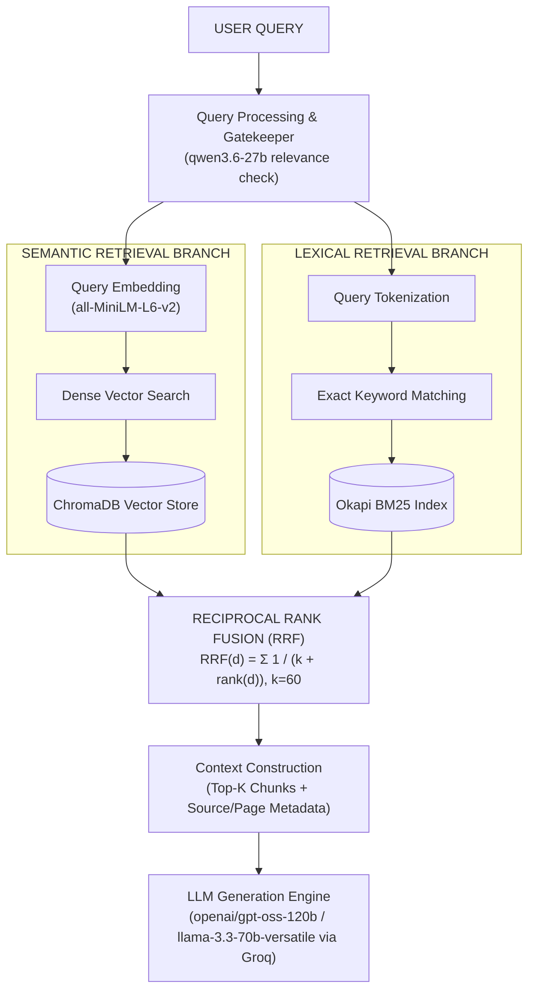
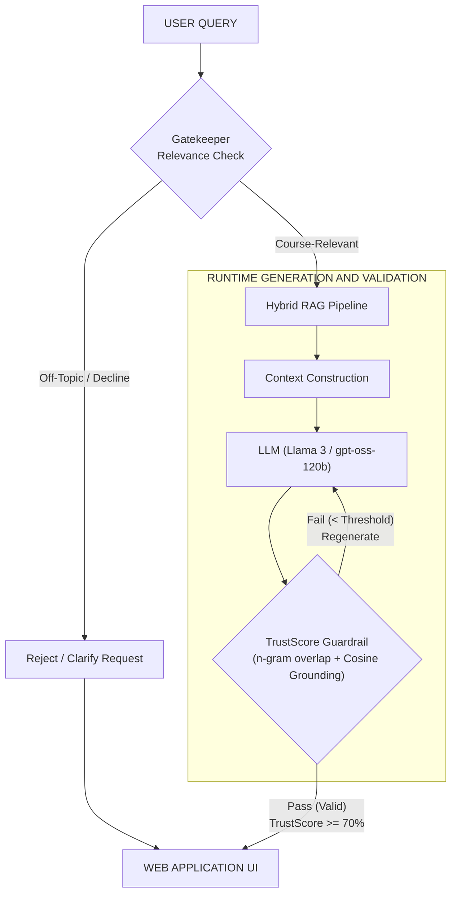
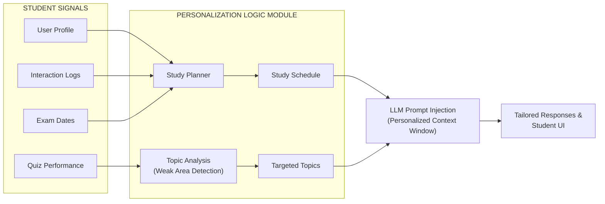
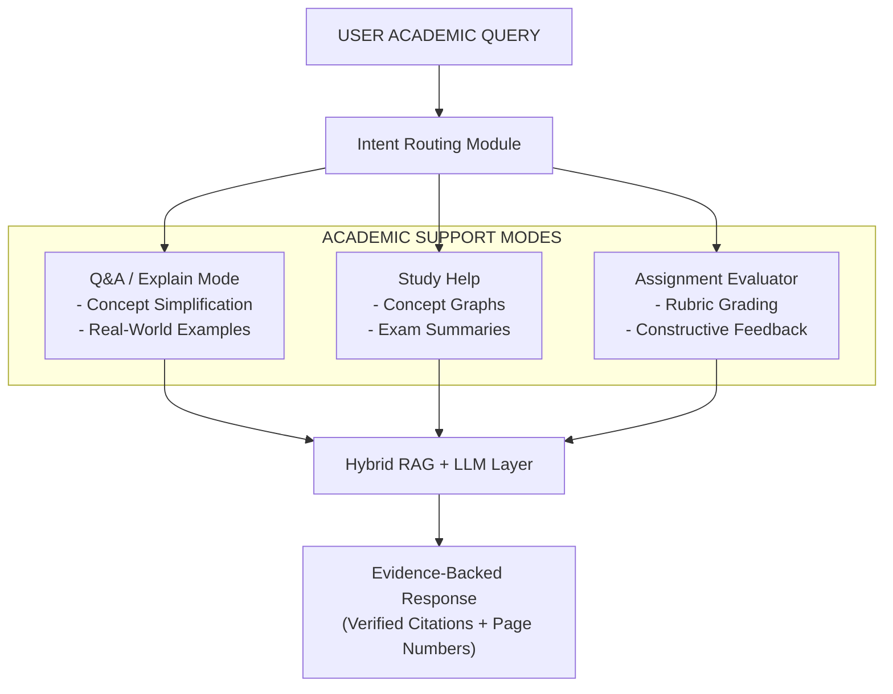
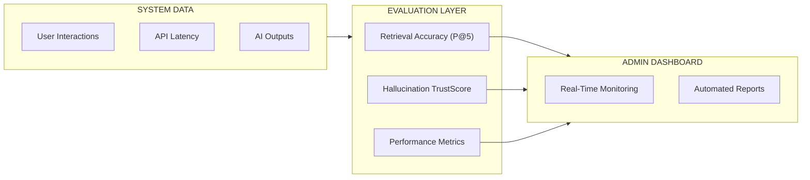
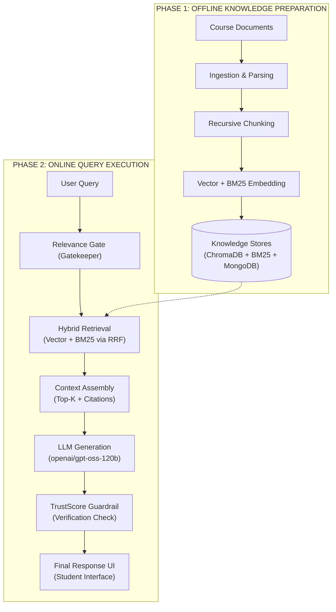

# EduMentor AI 🎓

> **Explainable Multi-Course Educational Chatbot Using Llama 3, Hybrid RAG, and Hallucination Detection**

A production-ready, AI-powered virtual tutor for higher education. Built with React, Node.js, MongoDB, ChromaDB, and Llama 3 via Groq API.

[](https://nodejs.org)
[](https://react.dev)
[](https://typescriptlang.org)
[](https://groq.com)

---

## ✨ Features

### 🎓 Student Features
- **AI Chat Tutor** — ChatGPT-style interface with course-specific RAG
- **Hybrid RAG** — Vector similarity + BM25 keyword search with Reciprocal Rank Fusion
- **Hallucination Detection** — Trust score per response (0-100%)
- **Explainable AI** — Source documents, page numbers, confidence scores
- **Quiz Generator** — MCQ, Short Answer, Long Answer with difficulty levels
- **Progress Tracking** — Learning analytics dashboard
- **Personalized Recommendations** — AI-generated revision plans
- **Chat History** — Persistent conversation history

### 👨‍🏫 Faculty Features
- **Course Management** — Create and manage courses
- **Document Upload** — Drag-and-drop PDF/DOCX/PPTX/TXT
- **Auto-Processing** — Extract → Chunk → Embed → Store in ChromaDB
- **Analytics Dashboard** — System-wide metrics and usage stats

---

## 🏗️ Tech Stack

| Layer | Technology |
|---|---|
| **Frontend** | React 18, TypeScript, Vite, Tailwind CSS, MUI, Framer Motion |
| **Backend** | Node.js, Express, TypeScript |
| **AI/LLM** | Llama 3 70B via Groq API |
| **Vector DB** | ChromaDB |
| **Main DB** | MongoDB Atlas |
| **Embeddings** | HuggingFace Inference API (all-MiniLM-L6-v2) |
| **RAG** | Hybrid: Vector + BM25 + Reciprocal Rank Fusion |
| **Auth** | JWT + bcrypt |

---

## 📁 Project Structure

```
c:\Chatbot\
├── frontend/          # React + Vite + TypeScript frontend
│   └── src/
│       ├── components/    # Reusable UI components
│       ├── pages/         # Route-level pages
│       ├── services/      # Axios API services
│       ├── store/         # Zustand state management
│       └── types/         # TypeScript types
│
├── backend/           # Node.js + Express + TypeScript backend
│   └── src/
│       ├── models/        # MongoDB Mongoose schemas
│       ├── controllers/   # Route handlers
│       ├── routes/        # Express routers
│       ├── services/
│       │   ├── ai/        # Groq LLM integration
│       │   ├── rag/       # Hybrid RAG (Vector + BM25 + RRF)
│       │   ├── hallucination/  # Trust score computation
│       │   ├── explainability/ # Source citation builder
│       │   ├── quiz/      # Quiz generation
│       │   └── recommendations/ # Personalized learning
│       ├── middleware/    # Auth, upload, error handling
│       └── utils/         # Document processor, chunker, embeddings
│
├── docker-compose.yml # ChromaDB + MongoDB local setup
└── README.md
```

---

## 🚀 Quick Start

### Prerequisites
- Node.js 20+
- Docker (for ChromaDB)
- MongoDB Atlas account (or local Docker MongoDB)
- Groq API key ([Get free at groq.com](https://console.groq.com))
- HuggingFace API key ([Get free at huggingface.co](https://huggingface.co/settings/tokens))

### 1. Start Infrastructure

```bash
docker-compose up -d
```

This starts ChromaDB on port `8000` and optional local MongoDB on port `27017`.

### 2. Setup Backend

```bash
cd backend
cp .env.example .env
# Edit .env with your GROQ_API_KEY, MONGODB_URI, HF_API_KEY
npm install
npm run dev
```

Backend runs on `http://localhost:5000`

### 3. Setup Frontend

```bash
cd frontend
npm install
npm run dev
```

Frontend runs on `http://localhost:5173`

### 4. Seed Courses

1. Register as **Faculty**
2. Go to **Courses** → Click **Seed Defaults** to create 5 predefined courses:
   - Database Management Systems
   - Operating Systems
   - Computer Networks
   - Data Structures
   - Machine Learning

### 5. Upload Course Materials

1. Go to **Upload Documents**
2. Select a course
3. Drag-and-drop your PDFs/DOCX files
4. Wait for processing (chunks → embeddings → ChromaDB)

### 6. Chat with the AI Tutor!

1. Register as **Student** → Select a course → Ask questions

---

## 🔧 Environment Variables

### Backend (`backend/.env`)

| Variable | Description | Required |
|---|---|---|
| `GROQ_API_KEY` | Groq API key for Llama 3 | ✅ Yes |
| `MONGODB_URI` | MongoDB connection string | ✅ Yes |
| `JWT_SECRET` | JWT signing secret | ✅ Yes |
| `HF_API_KEY` | HuggingFace API for embeddings | Recommended |
| `CHROMA_URL` | ChromaDB server URL | Default: `http://localhost:8000` |

---

## 🔌 API Reference

### Authentication
| Method | Endpoint | Description |
|---|---|---|
| POST | `/api/auth/register` | Create account |
| POST | `/api/auth/login` | Get JWT token |
| GET | `/api/auth/me` | Get current user |

### Courses
| Method | Endpoint | Description |
|---|---|---|
| POST | `/api/course/create` | Create course (faculty) |
| GET | `/api/course/all` | List all courses |
| POST | `/api/course/enroll` | Enroll student |
| POST | `/api/course/seed` | Seed predefined courses |

### Documents
| Method | Endpoint | Description |
|---|---|---|
| POST | `/api/document/upload` | Upload PDF/DOCX/PPTX |
| GET | `/api/document/all` | List documents |

### Chat (RAG Pipeline)
| Method | Endpoint | Description |
|---|---|---|
| POST | `/api/chat/query` | Ask question → get answer + sources + trust score |
| GET | `/api/chat/history` | Chat history |

### Quiz
| Method | Endpoint | Description |
|---|---|---|
| POST | `/api/quiz/generate` | Generate MCQ/Short/Long questions |
| POST | `/api/quiz/evaluate` | Submit answers |

### Analytics
| Method | Endpoint | Description |
|---|---|---|
| GET | `/api/analytics/dashboard` | Admin stats |
| GET | `/api/analytics/progress` | Student progress |

---

## 🏛️ System Architecture & Methodology (IEEE Paper)

> **"LLM-Driven Intelligent Educational Platform Using Hybrid RAG for Personalized Learning and Academic Support"**  
> *Authors: Vanitha P, Deepak K, Deva C (Dept. of Information Technology, Kongu Engineering College)*

### Fig. 1. Overall System Architecture of the Proposed Educational Platform



---

### Fig. 2. Knowledge Acquisition and Document Processing Pipeline



---

### Fig. 3. Hybrid Retrieval-Augmented Generation Architecture



---

### Fig. 4. Query Processing and Response Generation Workflow



---

### Fig. 5. Personalized Learning Architecture



---

### Fig. 6. Academic Support Workflow



---

### Fig. 7. Administrative and Evaluation Architecture



---

### Fig. 8. End-to-End Methodology of the Proposed Platform



---

## 🎨 UI Highlights

- **Dark glassmorphism** design with backdrop blur
- **Apple-inspired** typography (Inter font)
- **ChatGPT-style** chat interface
- **Framer Motion** animations
- **Responsive** mobile-first layout
- **Real-time** trust score badges
- **Collapsible** source citation panels

---

## 🚀 Deployment Guide

### Frontend → Vercel

```bash
cd frontend
npm run build
# Deploy dist/ to Vercel
```

Set env: `VITE_API_URL=https://your-backend.onrender.com/api`

### Backend → Render

1. Create a new Web Service on Render
2. Set root directory to `backend`
3. Build command: `npm install && npm run build`
4. Start command: `node dist/server.js`
5. Add environment variables from `.env.example`

### ChromaDB → Render

1. Create a new Web Service with Docker
2. Use image: `ghcr.io/chroma-core/chroma:latest`
3. Port: `8000`
4. Set `CHROMA_URL` in your backend env to this service URL

### MongoDB → MongoDB Atlas

1. Create free cluster at [mongodb.com/atlas](https://mongodb.com/atlas)
2. Add IP whitelist (0.0.0.0/0 for Render)
3. Create database user
4. Copy connection string to `MONGODB_URI`

---

## 📄 License

MIT License — Built for educational purposes.

---

*Built with ❤️ using Llama 3, Hybrid RAG, and modern web technologies*
