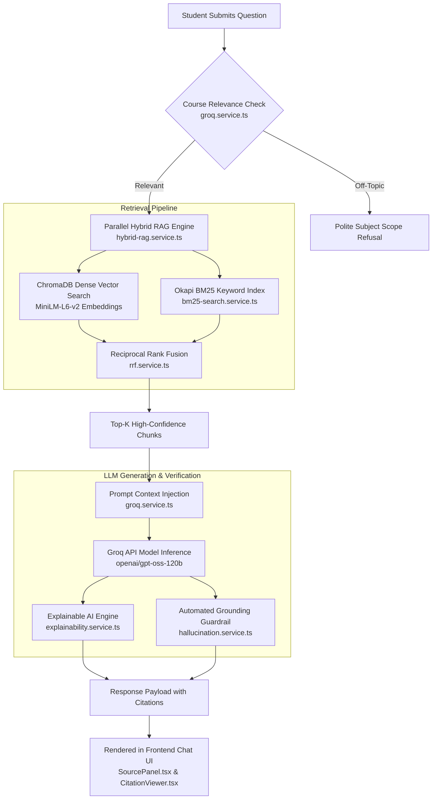

# EduMentor AI: RAG Retrieval, Citation, and Evidence Grounding Architecture

This document provides a comprehensive technical breakdown of how **EduMentor AI** retrieves course documents, constructs prompt contexts, generates LLM answers, extracts source citations, and validates evidence grounding to prevent hallucinations.

---

## 1. Architectural Overview Diagram



---

## 2. Technical Pipeline Breakdown

### Phase 1: Subject Scope & Relevance Validation
- **Source Code:** [`backend/src/services/ai/groq.service.ts`](file:///c:/Chatbot/backend/src/services/ai/groq.service.ts#L283) (`isQuestionRelevantToCourse`)
- **Mechanism:** Before retrieving document chunks, a fast LLM classification prompt checks if the student's question falls within the scope of the active course syllabus.
- **Scope Rule:** If off-topic (e.g., general entertainment trivia in an Operating Systems class), the bot politely declines to preserve course context integrity.

---

### Phase 2: Parallel Hybrid Retrieval (Dense Vector + Sparse BM25)
- **Source Code:** [`backend/src/services/rag/hybrid-rag.service.ts`](file:///c:/Chatbot/backend/src/services/rag/hybrid-rag.service.ts#L37) (`hybridRetrieve`)
- **Dual Pipeline:**
  1. **Dense Vector Search**: Converts the query into a 384-dimensional dense embedding via HuggingFace `all-MiniLM-L6-v2` and calculates Cosine Similarity against indexed document chunks in ChromaDB.
  2. **Sparse Keyword Search**: Queries an inverted Okapi BM25 index ([`bm25-search.service.ts`](file:///c:/Chatbot/backend/src/services/rag/bm25-search.service.ts)) to capture exact academic terms, abbreviations, and codes.

---

### Phase 3: Reciprocal Rank Fusion (RRF) Re-Ranking
- **Source Code:** [`backend/src/services/rag/rrf.service.ts`](file:///c:/Chatbot/backend/src/services/rag/rrf.service.ts#L1) (`reciprocalRankFusion`)
- **Mathematical Formula:**
  $$\text{RRF\_Score}(d) = \sum_{m \in \{\text{Vector}, \text{BM25}\}} \frac{1}{k + r_m(d)} \quad (k=60)$$
  where $r_m(d)$ is the 1-based rank position of document chunk $d$ in retrieval method $m$.
- **Outcome:** RRF merges semantic similarity with keyword precision to pick the Top-$K$ highest-confidence context chunks.

---

### Phase 4: Context Injection & LLM Inference
- **Source Code:** [`backend/src/services/ai/groq.service.ts`](file:///c:/Chatbot/backend/src/services/ai/groq.service.ts#L35) (`buildCourseSystemPrompt`)
- **Context Payload:**
  ```text
  You are EduMentor AI, an expert educational assistant for higher education students.
  🎓 ACTIVE COURSE: "Operating Systems"

  --- COURSE MATERIAL CONTEXT ---
  [Document: OS_Lecture_4.pdf | Page 12]
  The data link layer framing organizes raw bits into discrete logical frames...
  
  [Document: Networking_Syllabus.pdf | Page 3]
  ...
  --- END CONTEXT ---

  Base your answer primarily on the above context.
  ```
- **Execution:** Sent to Groq Cloud LLM API (`openai/gpt-oss-120b`). Context payloads are automatically truncated to safe token limits to prevent TPM quota errors.

---

### Phase 5: Explainable AI & Source Citation Extraction
- **Source Code:** [`backend/src/services/explainability/explainability.service.ts`](file:///c:/Chatbot/backend/src/services/explainability/explainability.service.ts#L31) (`buildExplainableResult`)
- **Extracted Citation Structure:**
  Each AI response attaches structured source citations:
  - `documentName`: Full name of the source PDF / lecture document (e.g. `OS_Chapter_3.pdf`).
  - `pageNumber`: Specific page number in the source file (e.g. `Page 14`).
  - `excerpt`: Verbatim ground-truth text snippet (up to 300 characters).
  - `confidencePercent`: Reciprocal rank fusion relevance confidence score ($0\text{–}100\%$).

---

### Phase 6: Automated Grounding & Hallucination Guardrails
- **Source Code:** [`backend/src/services/ai/hallucination.service.ts`](file:///c:/Chatbot/backend/src/services/ai/hallucination.service.ts#L1) (`detectHallucination`)
- **Verification Logic:** Measures n-gram sentence alignment and cosine similarity between generated answer sentences and retrieved source chunks:
  - **Trust Score $\ge 75\%$**: Marked as **Verified Grounded** (Green Badge).
  - **Trust Score $45\text{–}74\%$**: Marked as **Partially Verified** (Amber Badge).
  - **Trust Score $< 45\%$**: Marked as **Unverified / Flagged** (Red Badge).

---

## 3. Frontend Evidence Inspection UI

In the **AI Chat Tutor** interface:

1. **Inline Source Counter**: Every assistant message displays an expandable toggle:
   `▲ 3 Sources Cited` ([`MessageBubble.tsx`](file:///c:/Chatbot/frontend/src/components/chat/MessageBubble.tsx#L162)).
2. **Source Citation Panel**: Clicking the toggle opens [`SourcePanel.tsx`](file:///c:/Chatbot/frontend/src/components/chat/SourcePanel.tsx), displaying:
   - Trust score badge ($0\text{–}100\%$)
   - Document title & page reference
   - Confidence match bar
3. **Deep Citation Drawer**: Clicking **`🔎 Inspect`** opens [`CitationViewer.tsx`](file:///c:/Chatbot/frontend/src/components/chat/CitationViewer.tsx) showing the full verbatim source quote, document metadata, and study helper tips.
